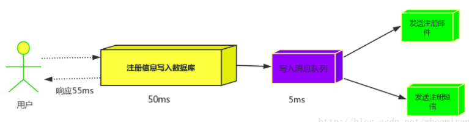

# rabbitmq

## 1. 定义

​	rabbitmq就是一种消息队列

## 2. 作用

- 异步处理

  ​	接收到用户请求后，当A业务执行成功后，需要执行B业务和C业务，但是A业务不依赖B业务和C业务的处理结果，此时就可以将B、C业务放入消息队列，直接响应用户，以缩短响应时间

  ​	异步方式：

  ​	 

  ​	消息队列：

  ​		 

- 应用解耦

  传统方式：

   

  有了消息队列，订单系统和库存系统都和消息队列打交道，所以完全解耦了

   

- 流量削峰

  ​	在高流量访问的情景下，使用消息队列，请求过来之后先进行排队，队满了直接返回错误信息，只有放入消息队列的才能进行后续处理，这样就相当于在服务器前端设置了1个阀门，来解决流量过大时对服务器造成压力的问题。

   

## 3. 软件

### 3.1 安装

#### 3.1.1 mac

```
brew install rabbitmq
```

安装rabbitmq后会自动安装对应版本的ERlang

此时rabbitmq被安装在了`/usr/local/sbin`路径下，需要将该路径加入到环境变量

```
open -e ~/.bash_profile
```

在该文件中加上`PATH=$PATH:/usr/local/sbin`，保存退出，生效配置

```
source ~/.bash_profile
```

然后执行下面内容启动rabbitmq服务

```
rabbitmq-server
```

此时在浏览器输入`localhost:15672`即可访问rabbitmq控制台，管理员账号密码都是`guest`

#### 3.1.2 ubuntu

> 参见：https://wangxin1248.github.io/linux/2020/03/ubuntu-install-rabbitmq.html

### 3.2. 添加用户

​	在后台管理界面，选择admin，点击`add a user`，输入账号、密码、tags

​	注意：tags点击该栏下方的几个选项进行选择

​	 

### 3.3. 添加虚拟主机

​	添加完用户后，可以看到新创建的用户没有虚拟主机，接下来需要为该用户添加虚拟主机

​	 

​	点击`admin`下的`Virtual Hosts`进行添加，主机名称为`/xxxx`形式

​	 

​	添加虚拟主机之后，需要将该虚拟主机对用户授权

​	点击刚创建的虚拟主机，进入该主机的配置页面

​	 

​	在配置页中，找到`Pemissions`设置项，对用户进行授权

​	 

## 4. 工程搭建

- 创建maven项目

- 添加依赖

  ```xml
  <dependency>
      <groupId>com.rabbitmq</groupId>
      <artifactId>amqp-client</artifactId>
      <version>5.2.0</version>
  </dependency>
  ```

## 5. 操作队列

### 5.1. 简单队列

#### 5.1.1. 模型

​	 

- 角色

		P：生产者

		红色方块：队列
		
		C：消费者

- 这三个角色是独立的应用程序

   队列位于rabbitmq服务器的1个虚拟主机中

  生产者位于A应用程序，获取连接后，就可以向rabbitmq服务器的虚拟主机投递消息

  消费者位于B应用程序，获取连接后，就可以从rabbitmq服务器的虚拟主机获取消息

#### 5.1.2. 获取连接

```java
public class ConnectionUtil {
    public static Connection getConnection() throws IOException, TimeoutException {
        //定义工厂类
        ConnectionFactory factory = new ConnectionFactory();
        //设置要连接的rabbitmq服务器IP
        factory.setHost("127.0.0.1");
        //设置AMQP协议的端口号
        factory.setPort(5672);
        //设置要连接的虚拟主机
        factory.setVirtualHost("/vhost_test");
        //设置该虚拟主机授权的1个账户和密码
        factory.setUsername("shuyan");
        factory.setPassword("943397");
        //在工厂中获取1个新的Connection对象并返回
        return factory.newConnection();
    }
}
```

其中：

- AMQP协议的端口号在rabbitmq服务器管理页面中可以查看

   

#### 5.1.3. 生产者发送消息

```java
public class Productor {
    //使用的队列名称
    private static final String QUEUE_NAME = "simple_test_queue";

    public static void main(String[] args) throws IOException, TimeoutException {
        //使用ConnectionUtil工具类获取连接
        Connection con = ConnectionUtil.getConnection();
        //在连接中获取1个通道
        Channel channel = con.createChannel();
        //在通道中声名1个队列
        channel.queueDeclare(QUEUE_NAME, false, false, false, null);
        //定义待发送消息
        String msg = "hello rabbitmq test";
        //向队列中发送消息
        channel.basicPublish("", QUEUE_NAME, null, msg.getBytes());
        System.out.println("send");
        //关闭连接和通道
        channel.close();
        con.close();
    }
}
```

在后台下图操作，即可将消息取出

 

#### 5.1.4. 消费者获取消息

```java
public class Customer {
    //使用的队列名称
    private static final String QUEUE_NAME = "simple_test_queue";

    public static void main(String[] args) throws IOException, TimeoutException {
        //使用ConnectionUtil工具类获取连接
        Connection con = ConnectionUtil.getConnection();
        //在连接中获取1个通道
        Channel channel = con.createChannel();
        //在通道中声名1个队列
        channel.queueDeclare(QUEUE_NAME, false, false, false, null);
        //创建consumer对象，并重写接收到消息的回调函数
        DefaultConsumer consumer = new DefaultConsumer(channel) {
            @Override
            public void handleDelivery(String consumerTag, Envelope envelope, AMQP.BasicProperties properties, byte[] body) throws IOException {
                String message = new String(body, "utf-8");
                System.out.println(message);
            }
        };
        //使用consumer对象监听通道
        channel.basicConsume(QUEUE_NAME, true, consumer);
    }
}
```

#### 5.1.5. 缺点

- 耦合度高
- 生产者与消费者一一对应，不能有多个消费者
- 队列名固定

### 5.2. 工作队列

#### 5.2.1. 模型

 

#### 5.2.2. 轮训分发

- 生产者

  代码与简单对列生产者代码完全相同

- 消费者

  代码与简单队列消费者完全相同，只不过消费者代码可以运行多个

- 分发方式

		该方法采用的是`轮训分发`方式，所有消费者轮流处理队列中的消息

#### 5.2.3. 公平分发

- 概念

  ​	每个消费者处理完1个消息后，手动向队列进行应答，应答后队列才可以向该消费者发送1条消息，消费者应答之前不可以再进行发送

  ​	这样处理后，对列会根据每个消费者是否忙碌合理分发队列中的消息

- 代码

  - 生产者

    - 声名队列后，设置通道每次只分发1个（`basicQoc(1)`）

    ```java
    public class Productor {
        //使用的队列名称
        private static final String QUEUE_NAME = "work_test_queue";

        public static void main(String[] args) throws IOException, TimeoutException {
            //使用ConnectionUtil工具类获取连接
            Connection con = ConnectionUtil.getConnection();
            //在连接中获取1个通道
            Channel channel = con.createChannel();
            //在通道中声名1个队列
            channel.queueDeclare(QUEUE_NAME, false, false, false, null);
            //限定1个消费者每次只处理1条消息，消费者应答之前不再发送下一条消息
            channel.basicQos(1);
            //定义待发送消息
            String msg = "hello rabbitmq work test";
            //向队列中发送消息
            channel.basicPublish("", QUEUE_NAME, null, msg.getBytes());
            System.out.println("send");
            //关闭连接和通道
            channel.close();
            con.close();
        }
    }
    ```

  - 消费者

    - 声名队列后，设置通道每次只分发1个（`basicQoc(1)`）
    - 关闭自动应答（`autoAck`）
    - 每次处理完消息后，手动应答（`basicAck()`）

    ```java
    public class Customer1 {
        //使用的队列名称
        private static final String QUEUE_NAME = "work_test_queue";

        public static void main(String[] args) throws IOException, TimeoutException {
            //使用ConnectionUtil工具类获取连接
            Connection con = ConnectionUtil.getConnection();
            //在连接中获取1个通道
            final Channel channel = con.createChannel();
            //在通道中声名1个队列
            channel.queueDeclare(QUEUE_NAME, false, false, false, null);
            //限定1个消费者每次只处理1条消息，消费者应答之前不再发送下一条消息
            channel.basicQos(1);
            //创建consumer对象，并重写接收到消息的回调函数
            DefaultConsumer consumer = new DefaultConsumer(channel) {
                @Override
                public void handleDelivery(String consumerTag, Envelope envelope, AMQP.BasicProperties properties, byte[] body) throws IOException {
                    String message = new String(body, "utf-8");
                    System.out.println("[1]"+message);
                    //手动应答
                    channel.basicAck(envelope.getDeliveryTag(),false);
                }
            };
            //使用consumer对象监听通道
            //关闭自动应答
            boolean autoAck = false;
            channel.basicConsume(QUEUE_NAME, autoAck, consumer);
        }
    }
    ```

### 5.3. 订阅模式

#### 5.3.1. 模型

​	 


## 6. 概念

### 6.1. 消息应答

​	消息应答就是：当队列将消息分发给消费者后，消费者将给队列进行消息应答，应答后队列才可以将该消息从内存中删除。

```java
boolean autoAck = false;
channel.basicConsume(QUEUE_NAME, autoAck, consumer);
```

`autoAck`用于设置是否进行自动应答：

- `true`:设置为自动应答；每次分发消息后，立即自动进行应答，队列中立即将消失删除

  > 此时，如果队列中已经将消失删除了，但是消费者进行再处理过程中意外挂掉，则会产生消息丢失

- `false`：设置为手动应答；每次分发消息后，等待消费者处理结束后手动应答，队列中才将消息删除

  > ​	此时，即使消费者进程意外挂掉，队列会知道这个消费者挂掉了（猜测类似于心跳包的机制），因为队列中还没有将该消息删除，队列还可以将消息发给其他的消费者处理，这样避免了消息丢失

  - 手动应答

    ```java
    channel.basicAck(envelope.getDeliveryTag(),false);
    ```

### 6.2. 消息持久化

​	消息持久化就是：将队列和消息存储到文件中，以避免rabbitmq服务器宕机导致的消息丢失

```java
//在通道中声名1个队列
//启动消息持久化
boolean durable = true;
channel.queueDeclare(QUEUE_NAME, durable, false, false, null);
```

​	`durable`用于设置是否启动消息持久化

## 插件

### 延时队列

#### 安装

+ [下载对应版本插件](https://bintray.com/rabbitmq/community-plugins/rabbitmq_delayed_message_exchange) 

+ 放入rabbitmq得plugins目录下，如：

  ```
   /usr/lib/rabbitmq/lib/rabbitmq_server-3.6.12/plugins
  ```

+ 启用

  ```sh
  $ rabbitmq-plugins enable rabbitmq_delayed_message_exchange
  ```

#### 示例代码

+ 配置声明队列

  ```java
  @Bean
  public CustomExchange webMsgDelayExchange() {
      Map<String, Object> args = new HashMap<>(8);
      args.put(RabbitMqConstants.EXCHANGE_X_DELAYED_TYPE, RabbitMqConstants.EXCHANGE_TYPE_DIRECT);
      return new CustomExchange(RabbitMqConstants.WEB_MESSAGE_REMIND_QUEUE, RabbitMqConstants.EXCHANGE_TYPE_DELAY_MSG,true, false,args);
  }
  
  @Bean
  public Binding webMsgBinding() {
      return BindingBuilder.bind(webMsgQueue()).to(webMsgDelayExchange()).with(RabbitMqConstants.WEB_MESSAGE_REMIND_QUEUE).noargs();
  }
  
  @Bean
  public Queue webMsgQueue() {
      return new Queue(RabbitMqConstants.WEB_MESSAGE_REMIND_QUEUE);
  }
  ```

+ 发送延时消息

  ```java
  rabbitTemplate.convertAndSend(RabbitMqConstants.APP_MESSAGE_REMIND_EXCHANGE, RabbitMqConstants.APP_MESSAGE_REMIND_QUEUE, JSONArray.toJSONString(Collections.singletonList(messageVo)), mqMessage -> {
      mqMessage.getMessageProperties().setHeader(RabbitMqConstants.X_DELAY_HEADER, finalDelayMs);
      return mqMessage;
  });
  ```

# 总结

+ [【原创】分布式之消息队列复习精讲](https://www.cnblogs.com/rjzheng/p/8994962.html) 
+ 


